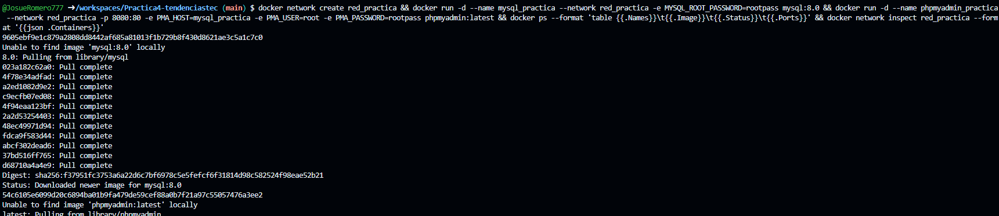
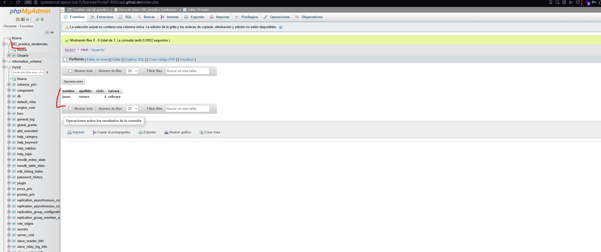

## Práctica servidor web: MySQL + phpMyAdmin en contenedores Docker

### 1. Título
Implementación de contenedores MySQL y phpMyAdmin conectados en una red Docker personalizada

### 2. Tiempo de duración
45 minutos

### 3. Fundamentos
En esta práctica se trabaja con contenedores Docker para desplegar una base de datos MySQL y la herramienta de administración phpMyAdmin. Docker es una plataforma que permite empaquetar aplicaciones y sus dependencias en contenedores livianos y portables; cada contenedor ejecuta un proceso aislado con su propio sistema de archivos, red y espacio de procesos. El uso de contenedores facilita reproducibilidad, despliegue y escalabilidad.

MySQL es un sistema gestor de bases de datos relacional ampliamente usado. En un entorno con contenedores, MySQL se ejecuta dentro de un contenedor que expone el puerto 3306 para conexiones. phpMyAdmin es una interfaz web escrita en PHP que facilita administrar bases de datos MySQL/MariaDB: crear/editar tablas, ejecutar consultas SQL, importar/exportar datos, y gestionar usuarios y permisos.

Una red Docker personalizada conecta contenedores en un espacio de red aislado, permitiendo que los nombres de contenedores actúen como hostnames DNS. Esto simplifica la configuración: phpMyAdmin puede conectarse a MySQL usando el nombre del contenedor MySQL como `PMA_HOST`.

Beneficios clave:
- Aislamiento: la base de datos no requiere instalación local, está contenida.
- Portabilidad: el entorno puede levantarse en cualquier máquina con Docker.
- Reversibilidad: eliminar y recrear contenedores es sencillo.

En la parte práctica se crean dos contenedores:
- `mysql_practica`: imagen oficial `mysql:8.0`, con variable `MYSQL_ROOT_PASSWORD`.
- `phpmyadmin_practica`: imagen oficial `phpmyadmin`, configurada para conectar a `mysql_practica`. 

Figura 1-1. Diagrama de contenedores y red (colocar imagen en `screenshots/fig1-diagrama.png`).


### 4. Conocimientos previos
Para realizar esta práctica se necesita entender:
- Conceptos básicos de Docker: imágenes, contenedores, volúmenes y redes.
- Comandos Docker: `docker run`, `docker network create`, `docker ps`, `docker exec`.
- Conocimientos elementales de bases de datos MySQL: usuarios, bases de datos, puertos.
- Manejo básico de un navegador web para usar phpMyAdmin.

Ejemplos concretos de comandos que se utilizarán:
```bash
docker network create red_practica
docker run -d --name mysql_practica --network red_practica -e MYSQL_ROOT_PASSWORD=rootpass mysql:8.0
docker run -d --name phpmyadmin_practica --network red_practica -p 8080:80 -e PMA_HOST=mysql_practica -e PMA_USER=root -e PMA_PASSWORD=rootpass phpmyadmin:latest
```

### 5. Objetivos a alcanzar
- Implementar contenedores para MySQL y phpMyAdmin.
- Crear y usar una red Docker personalizada para la comunicación entre contenedores.
- Acceder a phpMyAdmin desde el navegador y crear una base de datos de prueba.
- Documentar el procedimiento y capturar evidencias (screenshots).

### 6. Equipo necesario
- Computador con sistema operativo Windows.
- Docker Engine (versión recomendada: 20.x o superior; el contenedor en este entorno usó `mysql:8.0` y `phpmyadmin:latest`).
- Navegador web moderno (Chrome, Firefox, Edge) para acceder a phpMyAdmin en `http://localhost:8080`.

### 7. Material de apoyo
- Documentación oficial de Docker: https://docs.docker.com/
- Documentación de MySQL: https://dev.mysql.com/doc/
- Documentación de phpMyAdmin: https://www.phpmyadmin.net/docs/
- Guías y cheat-sheets de comandos Linux y Docker.

### 8. Procedimiento (paso a paso)
Paso 1: Crear una red Docker personalizada

```bash
docker network create red_practica
```

Figura 8-1. Creación de la red Docker `red_practica` (captura: `screenshots/comandos_ejecutados.png`).


Paso 2: Levantar el contenedor MySQL

```bash
docker run -d --name mysql_practica --network red_practica -e MYSQL_ROOT_PASSWORD=rootpass mysql:8.0
```

Figura 8-2. Contenedor MySQL en ejecución (`docker ps`) — captura: `screenshots/contenedores.png`.


Paso 3: Levantar el contenedor phpMyAdmin y mapear puerto 8080

```bash
docker run -d --name phpmyadmin_practica --network red_practica -p 8080:80 -e PMA_HOST=mysql_practica -e PMA_USER=root -e PMA_PASSWORD=rootpass phpmyadmin:latest
```

Figura 8-3. phpMyAdmin accesible en el host en `http://localhost:8080` — captura: `screenshots/bd_manual.png`.


Paso 4: Acceder a phpMyAdmin y crear base de datos de prueba

1. Abrir el navegador y navegar a: http://localhost:8080
2. En la pantalla de login usar:
	 - Usuario: `root`
	 - Contraseña: `rootpass`
	 - Host: `mysql_practica` (si el campo está disponible; de no ser así, seleccionar `localhost` o dejar en blanco si phpMyAdmin detecta conexiones internas)
3. Desde la interfaz de phpMyAdmin: selección "Bases de datos" → Nombre: `practica_db` → Crear.

Figura 8-4. Creación de la base de datos `practica_db` en phpMyAdmin — captura: `screenshots/bd_manual.png`.


Paso 5: Limpieza (opcional)

```bash
docker stop phpmyadmin_practica mysql_practica
docker rm phpmyadmin_practica mysql_practica
docker network rm red_practica
```

### 9. Resultados esperados
- Ambos contenedores en ejecución y visibles con `docker ps`.
- phpMyAdmin accesible en `http://localhost:8080`.
- Capacidad para iniciar sesión con `root` y `rootpass` y crear la base de datos `practica_db` desde la interfaz.
- Capturas de pantalla de cada paso guardadas en la carpeta `screenshots/`:
		- `screenshots/fig1-diagrama.png` — Diagrama de contenedores
		- `screenshots/comandos_ejecutados.png` — Resultado de comandos ejecutados / creación de red (attachment)
		- `screenshots/contenedores.png` — Salida de `docker ps` mostrando MySQL y phpMyAdmin (attachment)
		- `screenshots/bd_manual.png` — Vista de phpMyAdmin con la base de datos y tabla creadas (attachment)

### 10. Bibliografía
- Docker Inc. (2021). Docker Documentation. https://docs.docker.com/
- Oracle (2020). MySQL Reference Manual. https://dev.mysql.com/doc/
- phpMyAdmin developers (2020). phpMyAdmin Documentation. https://www.phpmyadmin.net/docs/

---

